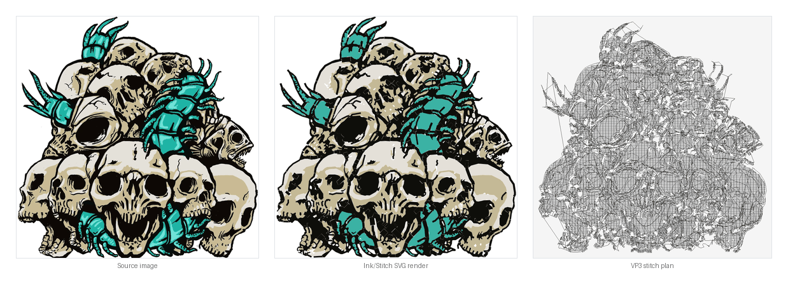
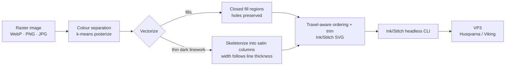
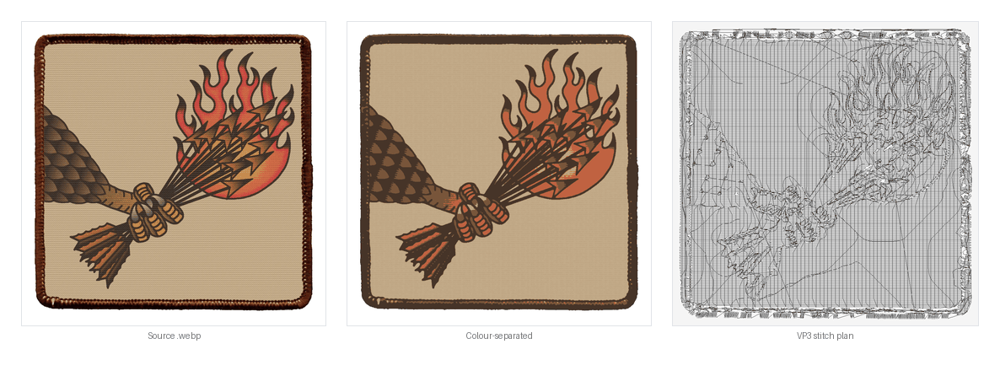
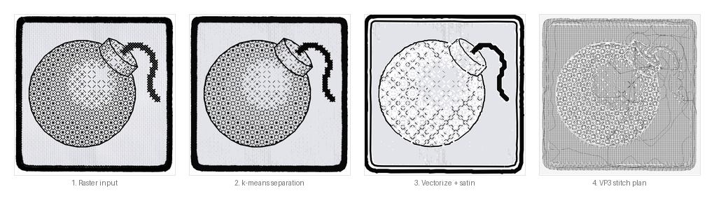

# Digitize Patches

**Turn a raster image into a pre-digitized [Ink/Stitch](https://inkstitch.org) SVG and a machine-ready VP3 embroidery file — fully headless, no Inkscape GUI required.**



*Left to right: source raster → rendered Ink/Stitch SVG (fills + satin linework) → VP3 stitch plan. Same design, end to end.*

---

## Features

- **Outlines become real satin.** The darkest colour's thin regions are skeletonized and emitted as Ink/Stitch satin columns whose width follows the local line thickness; solid areas stay fills.
- **Travel-aware stitch order.** Needle position is carried across colour layers and components (nearest-neighbour) — measured **7–10× less thread travel**.
- **Smart trimming** *(on by default)*. Cuts a jump when it is long (> 4 mm) **or** exposed (not covered by a later-stitched layer); jumps under 2 mm are skipped.
- **Safe density.** Default 0.4 mm fill spacing, with a warning outside the 0.3–0.6 mm safe band (needle-break vs. unfilled).
- **Patch border.** Satin border auto-detected/added; fills ordered light → dark; holes preserved; per-image YAML config (`order`, `skip_colors`, `density`, `border`, `trim`).
- **Deterministic and headless.** Reproducible output via a small `wx` stub + the Ink/Stitch CLI.

---

## Pipeline



---

## Preview



*Skyfowl patch: source `.webp` → colour-separated flat art → VP3 stitch plan. The satin border and outlines are generated automatically.*

<p align="center">
  
</p>

---

## Quick start

```bash
# image → Ink/Stitch SVG + VP3
tools/digitize/run.sh path/to/image.webp

# more colours, tighter fill density
tools/digitize/run.sh --density 0.35 --colors 8 img.jpg

# keep outlines as fills, disable trimming
tools/digitize/run.sh --no-trim --no-satin-outlines img.webp
```

Output lands in `work/`: `<name>.svg` (editable, opens in Inkscape) and `<name>.vp3` (machine file).

---

## How it works

1. **Classify** — transparent backgrounds are treated as patches (alpha silhouette + detected satin border); opaque art drops the lightest cluster as "paper" and routes the darkest to outlines.
2. **Denoise + posterize** — median filter, then k-means down to `--colors` flat thread colours.
3. **Vectorize** — each colour becomes closed `fill` regions with holes preserved (`fill-rule="evenodd"`); sub-mm specks are dropped.
4. **Outlines → satin** — thin runs of the outline colour are skeletonized into centre lines and emitted as satin columns that widen to match the local stroke.
5. **Order + trim** — components are sequenced by nearest-neighbour across layers, then long or exposed jumps are cut.
6. **Export** — the SVG is written with per-object Ink/Stitch parameters (`row_spacing_mm`, `trim_after`, `satin_column`) and converted to VP3 headlessly.

---

## Repo layout

```
tools/
├── digitize/
│   ├── run.sh          # one-shot CLI: image → SVG + VP3
│   ├── vectorize.py    # separation, vectorize, satin outlines, ordering, trim
│   ├── skeleton.py     # centre-line extraction for satin outlines
│   ├── analyze.py      # colour/region statistics for debugging separation
│   └── make_config.*   # per-image YAML config helper
└── wxstub/             # minimal wx shim so Ink/Stitch runs headless
docs/
├── USAGE.md            # full setup, every flag and tunable constant
└── assets/             # README previews
```

---

## Docs

Full setup instructions (Python 3.13 venv + vendored Ink/Stitch), every command-line flag, tunable constants, and known caveats live in **[docs/USAGE.md](docs/USAGE.md)**.

---

<p>
  <a href="docs/USAGE.md"></a>
  
  
  
  
</p>
